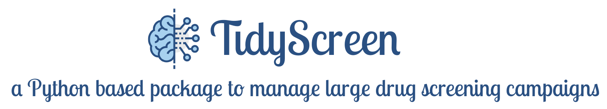
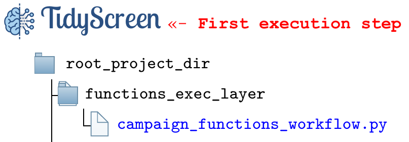
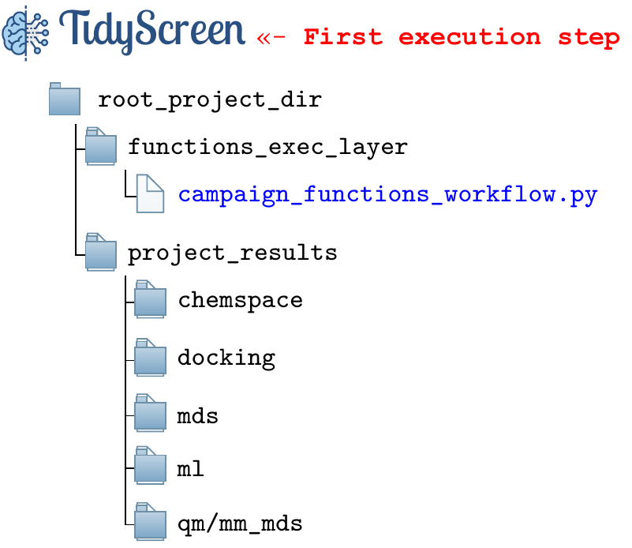

---
### **Project Overview** 
---

TidyScreen is a package developed at [MedChemLab](https://unitefa.conicet.unc.edu.ar/linea-investigacion-quimica-medicinal-y-diseno-de-farmacos/) with the aim of providing a structured framework for the **design**, **execution** and **documentation** of a virtual drug screening campaign.

Overall, the package provides functionalities capable of creating and organizing a given chemical space (*ChemSpace module*) intended to be explored through synthetically feasible chemical reactions. In a nutshell, the corresponding working chemical space is efficiently created from commercially available reactants a first stage of the virtual campaign execution. In this way, synthetic pathways are enumerated.

As part of further screening stages, the execution of molecular docking and molecular dynamics studies are also managed within TidyScreen.

A core feature common to TidyScreen philosophy is the use of [SQL databases](https://www.w3schools.com/sql/sql_intro.asp) to store in an organized fashion all the information relevant the campaign progress, including simulation conditions, results and raw data. In this respect, sharing of the whole project in the context of collaborative work and/or reproducing reported studies is straightforward.

---
#### Installation

Installation of the package is performed simply by cloning this repository, after which a **key requirement** is to create a [CONDA environment](https://docs.conda.io/projects/conda/en/latest/user-guide/getting-started.html) using the provided **tidyscreen.yml** file. Upon successful creation, this new environment (named: *tidyscreen*) will contain all the required Python modules necessary to execute every single TidyScreen action.

**Additional requirements not installed by CONDA**:
    
- [*AutoDock-GPU*](https://github.com/ccsb-scripps/AutoDock-GPU): TidyScreen has been prepared to work in conjunction with AutoDock-GPU, which has been developed in the [ForliLab](https://forlilab.org/) at Scripps Research. We acknowledge Stefano Forli, Diogo Santos-Martins and Andreas Tillack for the kind feedback during TidyScreen development.
&nbsp;
- [Amber](https://ambermd.org/) MD engine: this software package is required to confer TidyScreen the capability to prepare and document molecular dynamics simulations of docked poses.

---
#### **Basic usage:**

**STEP 1:** activate the required CONDA environment:
```bash
$ conda activate CCAD_platform  # The conda environment should have been previously created
```
&nbsp;

**STEP 2:** navigate to the folder in which the repository was cloned, and **create a project template** as follows:

```bash
$ cd functions_execution_layer
$ python generate_project_template.py

# You will be prompted to provide a general project name
$ Enter the name of the general project:

# After giving the project a name, the full path to the location in which the project is to be stored is required. 
# Be sure to have plenty of disk space available in this location, since all results associated to the project will be stored there
$ Enter the project base folder (full path):
```
Once you have accomplished the above mentioned steps, a full project structure will be created as shown in the figure below:



&nbsp;

**STEP 3:** execute the *{project_name}.py* script which is generated upon project creation in the _$BASE_FOLDER/functions_exec_layer_ folder. This will generate the whole project structure, including subfolder used to organize and store all the information related the screening campaign.  In this example, in STEP 2 the provided project name was "*campaign_functions_workflow*".

The following folders structure is created to organize the project:




---
#### **Description of project folders used to organize the information**

The *'__root_project_dir__'* &nbsp; folder will correspond to the name of the project as provided. Inside that folder, the following sub folders will be found:

- *'__functions_exec_layer__'*&nbsp;: inside this folder, a Python script named after the provided project name (_'{project_name}.py'_) will be found. This script is the place in which you should sequentially insert TidyScreen actions in order to sequentially construct a screening workflow. 

Within _**project_results**_, the following sub folders are created for the following purposes:

- **_./chemspace_**: will store all the results of the screening project associated with chemical reagent storage actions, custom reaction enumerations, reactants and molecule filters, etc.  In summary, all data corresponding to the generation and analysis of the working chemical space is stored in this sub folder.

- **_./docking_**: All results related to the execution of molecular docking assays, including storage of the corresponding receptors.

- **_./mds_**: All results related to the execution of molecular dynamics simulations.

- **_./ml_**: Data related to the use of machine learning classification models aimed to bioactive pose detection. **Under development**.

- **_./qm/mm_mds_**: Data related to the execution of hybrid quantum/classic molecular dynamics simulations. **Under development**.

Once the project structure has been created and the corresponding environment variables have been defined within the main execution script (_{project_name}.py_), it is time to start creating screening actions. Please follow the corresponding documentation and tutorials in order to construct custom screening workflows.